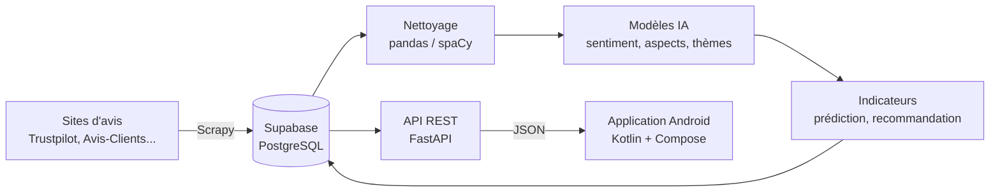

# FirmFactor

> **Data Science & IA pour l'analyse de la réputation en ligne**
> Projet de fin d'études — 5e année INFO IPS, ENSIM Le Mans (2026-2027)


---

## Sommaire

1. [Présentation du projet](#1-présentation-du-projet)
2. [Objectifs](#2-objectifs)
3. [Fonctionnalités prévues](#3-fonctionnalités-prévues)
4. [Architecture](#4-architecture)
5. [Technologies utilisées](#5-technologies-utilisées)
6. [Structure du dépôt](#6-structure-du-dépôt)
7. [Installation pas à pas](#7-installation-pas-à-pas)
8. [Lancer le projet](#8-lancer-le-projet)
9. [Règles de travail en équipe](#9-règles-de-travail-en-équipe)
10. [Démarche scientifique](#10-démarche-scientifique)
11. [Indicateurs de réputation](#11-indicateurs-de-réputation)
12. [Aspects légaux et éthiques](#12-aspects-légaux-et-éthiques)
13. [Planning et jalons](#13-planning-et-jalons)
14. [Équipe](#14-équipe)
15. [Dépannage (FAQ)](#15-dépannage-faq)

---

## 1. Présentation du projet

Chaque jour, des milliers d'internautes laissent des avis sur des commerces via des plateformes comme **Trustpilot**, **Avis-Clients** ou **MonAvisCompte**. Ces avis sont une mine d'informations, mais ils sont **nombreux, non structurés et difficiles à exploiter** à la main.

**FirmFactor** a pour but de transformer ces avis bruts en **informations utiles pour la décision** :

- **Collecter** automatiquement les avis sur le web (*data scraping*) ;
- **Analyser** leur contenu grâce à l'intelligence artificielle (*NLP*) : sentiment exprimé, sujets abordés, points forts et points faibles ;
- **Calculer** des indicateurs de réputation clairs ;
- **Prédire** l'évolution de la réputation et **recommander** des actions ;
- **Afficher** le tout dans une **application mobile Android** adaptée à deux types d'utilisateurs : le **client** et le **commerçant**.

Il s'agit d'un projet à caractère **Recherche & Développement** encadré par **Madeth MAY**.

---

## 2. Objectifs

### Objectif général

Concevoir une chaîne complète, **de la donnée brute jusqu'à la visualisation**, qui mesure et explique la réputation en ligne d'un commerce.

### Objectifs mesurables

| # | Objectif | Critère de réussite |
|---|---|---|
| O1 | Collecte automatisée | ≥ 3 sources, ≥ 50 000 avis, collecte planifiée |
| O2 | Analyse de sentiment | F1-macro ≥ 0,85, comparé à ≥ 2 modèles de référence |
| O3 | Analyse par aspect | Sentiment détecté sur ≥ 5 aspects (prix, livraison, SAV, qualité, accueil) |
| O4 | Indicateurs de réputation | ≥ 6 indicateurs documentés, dont un score global /100 |
| O5 | Prédiction de tendance | Erreur (MAE) inférieure à une prévision naïve |
| O6 | Application mobile | Parcours complets pour les 2 profils (client / commerçant) |
| O7 | Utilisabilité | Score SUS ≥ 70 lors des tests utilisateurs |

---

## 3. Fonctionnalités prévues

### Profil client 🧑

- Rechercher un commerce
- Consulter son **score de confiance** et un **résumé** des avis
- Voir ses points forts et ses points faibles
- Comparer plusieurs commerces
- Recevoir des recommandations de commerces similaires mieux notés

### Profil commerçant 🏪

- Suivre l'évolution de sa réputation dans le temps
- Identifier les **aspects à améliorer en priorité**
- Recevoir des **alertes** (pic d'avis négatifs)
- Se comparer à la moyenne de son secteur
- Consulter la **prévision** de sa note
- *(bonus)* Obtenir des suggestions de réponses aux avis

### Priorisation (méthode MoSCoW)

| Priorité | Fonctionnalités |
|---|---|
| **Must** (indispensable) | Collecte, sentiment, aspects, indicateurs, application 2 profils |
| **Should** (important) | Prédiction, recommandations commerçant, alertes |
| **Could** (bonus) | Détection de faux avis, réponses générées par LLM |

---

## 4. Architecture

Le principe clé : **l'application Android ne calcule rien, elle affiche**. Tous les traitements lourds se font côté serveur, en Python.



| Couche | Rôle | Dossier |
|---|---|---|
| **Collecte** | Récupère les avis sur le web, chaque nuit | `scraping/` |
| **Stockage** | Base de données centrale + authentification | Supabase (en ligne) |
| **Traitement & IA** | Nettoie les textes, entraîne et applique les modèles | `nlp/` |
| **API** | Expose les résultats sous forme de JSON | `api/` |
| **Application** | Affiche les indicateurs et graphiques | `android/` |

---

## 5. Technologies utilisées

| Domaine | Outils | Pourquoi ce choix |
|---|---|---|
| Collecte | **Scrapy**, scrapy-playwright | Standard du scraping en Python, gère les sites en JavaScript |
| Planification | **GitHub Actions** (cron) ou Prefect | Gratuit, aucun serveur à maintenir |
| Stockage | **Supabase** (PostgreSQL) | Base SQL + authentification + SDK Kotlin, offre gratuite |
| Traitement | **pandas**, **spaCy** (français) | Suffisant pour notre volume (< 1 million de lignes) |
| IA / NLP | **scikit-learn**, **Hugging Face Transformers** (CamemBERT), **BERTopic**, **KeyBERT** | Modèles de référence pour le français |
| Prédiction | **Prophet** | Simple et robuste pour les séries temporelles |
| Explicabilité | **SHAP** | Justifier les recommandations faites au commerçant |
| Suivi des expériences | **MLflow** ou Weights & Biases | Comparer les modèles de façon rigoureuse |
| Annotation | **Label Studio** | Créer un jeu de validation annoté à la main |
| API | **FastAPI** | Rapide, documentation automatique (Swagger) |
| Mobile | **Kotlin**, **Jetpack Compose**, Retrofit, Hilt, **Vico** | Stack Android moderne, graphiques natifs Compose |
| Conteneurs | **Docker**, docker compose | Même environnement pour tout le monde |
| Qualité | **pytest**, **ruff**, GitHub Actions | Tests et vérifications automatiques |
| Calcul GPU | Google Colab, Kaggle Notebooks | Fine-tuning des modèles gratuitement |
| Gestion de projet | GitHub Projects, UMBOX, Overleaf, Figma, Zotero | Tâches, fichiers, rapport, maquettes, bibliographie |

---

## 6. Structure du dépôt

```
FirmFactor/
├── api/                    # API FastAPI
│   ├── main.py             #   point d'entrée de l'API
│   └── Dockerfile          #   image Docker de l'API
├── scraping/               # Scrapers Scrapy (un spider par source)
├── nlp/                    # Modèles IA / NLP
│   └── notebooks/          #   notebooks d'exploration (EDA, essais)
├── android/                # Application mobile Kotlin
├── scripts/                # Scripts utilitaires
│   └── check_supabase.py   #   teste la connexion à la base
├── tests/                  # Tests automatiques (pytest)
├── docs/                   # Documentation interne
│   ├── CONTRIBUTING.md     #   règles Git de l'équipe
│   └── journal.md          #   journal de bord des séances
├── data/                   # Données locales — JAMAIS envoyées sur GitHub
├── .github/
│   ├── workflows/ci.yml    #   vérifications automatiques à chaque push
│   └── pull_request_template.md
├── .env.example            # Modèle des variables secrètes
├── .gitignore              # Fichiers exclus de Git
├── docker-compose.yml      # Lancement de tous les services
├── pyproject.toml          # Configuration des outils Python
└── requirements.txt        # Dépendances Python
```

---

## 7. Installation pas à pas

### 7.1 Prérequis

À installer **une seule fois** sur ta machine :

| Outil | Version | Lien |
|---|---|---|
| Git | récente | https://git-scm.com/downloads |
| Python | **3.11** | https://www.python.org/downloads/ |
| VS Code | récente | https://code.visualstudio.com/ (+ extensions *Python* et *Ruff*) |
| Docker Desktop | récente | https://www.docker.com/products/docker-desktop/ |
| Android Studio | récente | https://developer.android.com/studio *(pour la partie mobile)* |

> 💡 Sous Windows, coche **« Add Python to PATH »** pendant l'installation de Python.

Vérifie que tout est bien installé :

```bash
git --version
python --version
docker --version
```

### 7.2 Récupérer le projet

```bash
git clone https://github.com/Warren27026/FirmFactor.git
cd FirmFactor
```

### 7.3 Créer l'environnement Python

Un *environnement virtuel* isole les bibliothèques du projet de celles de ton ordinateur.

```bash
python -m venv .venv
```

Puis l'**activer** (à refaire à chaque nouveau terminal) :

```bash
# Windows (PowerShell)
.venv\Scripts\activate

# Mac / Linux
source .venv/bin/activate
```

Tu dois voir `(.venv)` au début de la ligne du terminal. Installe ensuite les dépendances :

```bash
pip install -r requirements.txt
```

### 7.4 Configurer les secrets (`.env`)

Les mots de passe et clés ne sont **jamais** mis sur GitHub. Ils sont stockés dans un fichier `.env` que chacun crée sur sa machine.

```bash
# Windows
copy .env.example .env

# Mac / Linux
cp .env.example .env
```

Ouvre `.env` et remplace les valeurs par celles partagées **en privé** dans le groupe de l'équipe :

| Variable | Où la trouver dans Supabase |
|---|---|
| `DATABASE_URL` | Bouton **Connect** → **Session pooler** |
| `SUPABASE_URL` | **Project Settings → API** → Project URL |
| `SUPABASE_ANON_KEY` | **Project Settings → API** → clé `anon` |

> ⚠️ Utilise bien la chaîne **Session pooler** : la connexion directe ne fonctionne qu'en IPv6 et échoue souvent sur le réseau de l'école.

### 7.5 Vérifier que tout fonctionne

```bash
python scripts/check_supabase.py
```
Résultat attendu : `✅ Connexion Supabase OK : PostgreSQL ...`

```bash
pytest
```
Résultat attendu : `1 passed`

---

## 8. Lancer le projet

### API sans Docker (pour développer)

```bash
uvicorn api.main:app --reload
```

### API avec Docker (comme en production)

```bash
docker compose up --build
```

Dans les deux cas, ouvre **http://localhost:8000/docs** : tu verras la documentation interactive de l'API, où tu peux tester chaque route.

| Route | Description | Statut |
|---|---|---|
| `GET /health` | Vérifie que l'API tourne | ✅ disponible |
| `GET /commerces` | Liste des commerces | 🔜 prévu |
| `GET /commerces/{id}/indicateurs` | Indicateurs d'un commerce | 🔜 prévu |
| `GET /commerces/{id}/avis` | Avis analysés d'un commerce | 🔜 prévu |

### Application Android

1. Ouvre le dossier `android/` dans **Android Studio**.
2. Attends la fin de la synchronisation Gradle.
3. Lance l'application sur un émulateur ou un téléphone (bouton ▶️).

> Depuis l'émulateur Android, l'API locale est accessible à l'adresse `http://10.0.2.2:8000` (et non `localhost`).

---

## 9. Règles de travail en équipe

### 9.1 Le circuit Git

**On ne travaille jamais directement sur `main`.** Chaque tâche suit ce cycle :

```bash
# 1. Se mettre à jour
git checkout main
git pull

# 2. Créer une branche pour sa tâche
git checkout -b feature/scraper-trustpilot

# 3. Travailler, puis enregistrer
git add .
git commit -m "feat: ajoute le scraper Trustpilot"

# 4. Envoyer sur GitHub
git push -u origin feature/scraper-trustpilot
```

5. Sur GitHub, ouvrir une **Pull Request**.
6. Un **autre membre** la relit et l'approuve.
7. On fusionne (*Merge*), puis on supprime la branche.

### 9.2 Nommer ses branches

| Préfixe | Usage | Exemple |
|---|---|---|
| `feature/` | Nouvelle fonctionnalité | `feature/score-reputation` |
| `fix/` | Correction de bug | `fix/connexion-api` |
| `docs/` | Documentation | `docs/etat-de-l-art` |
| `chore/` | Configuration, outils | `chore/ajout-docker` |
| `exp/` | Expérience IA | `exp/camembert-finetuning` |

### 9.3 Écrire ses messages de commit

Format : `type: description courte au présent`

```
feat: ajoute l'écran de connexion Android
fix: corrige le format des dates dans le scraper
docs: complète l'état de l'art sur l'analyse de sentiment
test: ajoute les tests de la route /health
```

### 9.4 Règles d'or

- 🔐 **Aucun secret sur GitHub** : les clés vont dans `.env` (déjà ignoré par Git).
- 📦 **Aucune donnée sur GitHub** : les avis collectés vont dans Supabase.
- 🧪 **Le code doit passer les tests** avant d'être fusionné.
- 📝 **Une tâche = un ticket** dans GitHub Projects.
- 🗒️ **Journal de bord** : `docs/journal.md` est rempli à la fin de chaque séance.

### 9.5 Organisation des séances

Séances : **lundi et mercredi, 13h45 – 17h45**.

| Moment | Durée | Contenu |
|---|---|---|
| Début | 15 min | Point d'équipe : fait / à faire / bloquants |
| Cœur | ~3 h | Travail, intégration, revue de code |
| Fin | 30 min | Mise à jour des tickets + journal de bord |

---

## 10. Démarche scientifique

Le projet suit une démarche **expérimentale et comparative** :

1. **État de l'art** : étude des méthodes existantes (scraping, analyse de sentiment, ABSA, systèmes de recommandation).
2. **Constitution du jeu de données** : collecte, nettoyage, analyse exploratoire (EDA).
3. **Annotation manuelle** d'environ 500 avis pour disposer d'une **vérité terrain** fiable.
4. **Modèles de référence** simples (ex. TF-IDF + régression logistique).
5. **Modèles avancés** (ex. CamemBERT *fine-tuné*), **comparés** aux modèles de référence.
6. **Évaluation** avec des métriques adaptées :

| Tâche | Métrique |
|---|---|
| Classification de sentiment | F1-macro, matrice de confusion |
| Thèmes | Cohérence des topics |
| Prédiction | MAE, RMSE |
| Recommandation | Précision@k, NDCG |
| Application | Score SUS (tests utilisateurs) |

7. **Traçabilité** : chaque expérience est enregistrée (paramètres, données, résultats) dans MLflow / W&B.

---

## 11. Indicateurs de réputation

*(Liste provisoire — à valider avec l'encadrant)*

| Indicateur | Description |
|---|---|
| **Score de réputation /100** | Score global combinant plusieurs indicateurs |
| Note pondérée dans le temps | Les avis récents comptent davantage |
| Sentiment par aspect | Prix, livraison, SAV, qualité, accueil… |
| Volume et rythme des avis | Nombre d'avis par période |
| Tendance | Évolution de la note / du sentiment (hausse ou baisse) |
| Taux et délai de réponse | Réactivité du commerçant aux avis |
| Écart note / sentiment | Détecte les incohérences entre étoiles et texte |
| Position sectorielle | Comparaison avec la moyenne du secteur |
| Indice de fiabilité | Part d'avis suspects *(bonus)* |

---

## 12. Aspects légaux et éthiques

La collecte d'avis en ligne implique des responsabilités :

- **Conditions d'utilisation** : certaines plateformes encadrent ou interdisent le scraping. Les sources utilisées sont validées avec l'encadrant.
- **Bonnes pratiques** : respect du fichier `robots.txt`, limitation du nombre de requêtes, identification du robot.
- **RGPD** : les pseudonymes des auteurs sont des données personnelles. Ils sont **anonymisés**, et seules les données nécessaires sont conservées.
- **Données hors GitHub** : aucune donnée collectée n'est publiée dans ce dépôt public.
- **Alternatives** : des jeux de données publics (Yelp Open Dataset, Amazon Reviews…) peuvent être utilisés pour l'entraînement des modèles.

---

## 13. Planning et jalons

| Sprint | Période | Objectif principal |
|---|---|---|
| 1 | 5 → 14 oct. 2026 | Cadrage, état de l'art, mise en place des outils |
| 2 | 19 oct. → 4 nov. | Collecte des données (scrapers + base) |
| 3 | 9 → 18 nov. | Nettoyage, EDA, annotation, maquettes |
| 4 | 23 nov. → 9 déc. | Premiers modèles + prototype Android |
| 🎤 | **10 déc. 2026** | **Soutenance intermédiaire** |
| 5 | 14 déc. → 13 janv. | Modèles NLP avancés |
| 6 | 18 → 27 janv. 2027 | Indicateurs, prédiction, recommandation |
| 7 | 1 → 10 févr. | Application complète *(gel des fonctionnalités le 10/02)* |
| 8 | 15 → 24 févr. | Tests utilisateurs, rapport, répétitions |
| 🎓 | **25 févr. 2027** | **Soutenance finale** |

Le suivi détaillé des tâches se fait dans l'onglet **Projects** de ce dépôt.

---

## 14. Équipe

| Membre | Rôle principal | GitHub |
|---|---|---|
| Warren | *à définir* | [@Warren27026](https://github.com/Warren27026) |
| Joel | *à définir* | *à compléter* |
| *à compléter* | *à définir* | *à compléter* |

**Encadrant :** Madeth MAY — ENSIM Le Mans

---

## 15. Dépannage (FAQ)

<details>
<summary><b>❌ <code>python</code> n'est pas reconnu (Windows)</b></summary>

Python n'a pas été ajouté au PATH. Réinstalle Python en cochant **« Add Python to PATH »**, ou utilise `py` à la place de `python`.
</details>

<details>
<summary><b>❌ <code>.venv\Scripts\activate</code> est bloqué (Windows)</b></summary>

Lance une seule fois dans PowerShell :

```powershell
Set-ExecutionPolicy -Scope CurrentUser RemoteSigned
```
</details>

<details>
<summary><b>❌ La connexion à Supabase échoue</b></summary>

- Vérifie que tu utilises la chaîne **Session pooler** (et non *Direct connection*).
- Vérifie que le mot de passe dans `DATABASE_URL` est correct.
- Le projet Supabase gratuit se met **en pause** après environ une semaine d'inactivité : relance-le depuis le tableau de bord Supabase.
</details>

<details>
<summary><b>❌ <code>docker compose</code> ne fonctionne pas</b></summary>

Vérifie que **Docker Desktop est lancé** (icône de baleine dans la barre des tâches) et que le fichier `.env` existe.
</details>

<details>
<summary><b>❌ J'ai un conflit Git</b></summary>

1. Ouvre le fichier concerné dans VS Code : les zones en conflit sont surlignées.
2. Choisis *Accept Current*, *Accept Incoming* ou *Accept Both*.
3. Puis :

```bash
git add .
git commit -m "fix: résolution du conflit"
```
</details>

<details>
<summary><b>❌ J'ai poussé un secret par erreur</b></summary>

Préviens immédiatement l'équipe, puis **régénère la clé** dans Supabase. Supprimer le fichier ne suffit pas : il reste visible dans l'historique Git.
</details>

---

<p align="center"><i>FirmFactor — ENSIM Le Mans — 2026-2027</i></p>
